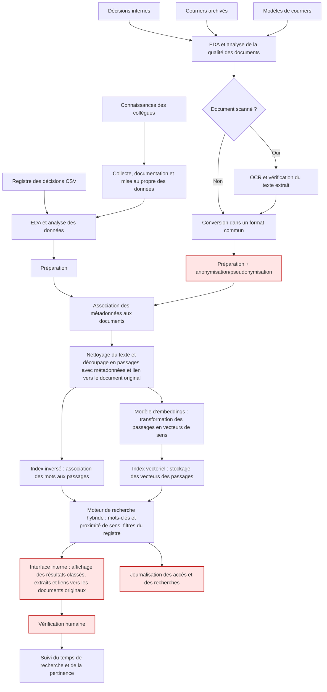

# Schéma d’architecture cible

--- 

- **Confidentialité** : anonymisation/pseudonymisation lors de la préparation, interface réservée aux employés et journalisation des accès et des recherches.
- **Résultats erronés** : extraits et liens vers les documents originaux dans l’interface, puis vérification humaine complète.

**Composants** : préparation des données, OCR, index textuel et vectoriel, modèle d’embeddings, moteur de recherche hybride, interface interne, revue humaine, suivi et journalisation.

**Ce qu’on n’a PAS mis (et pourquoi)** : LLM génératif et RAG (exactitude non garantie), base juridique publique (priorité à la recherche interne, les données publiques ont probablement déjà un système de recherche).
